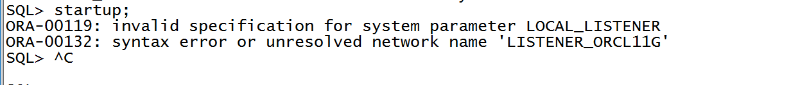
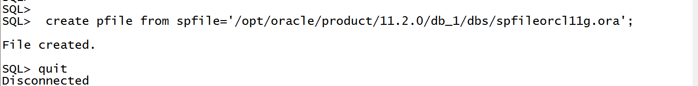
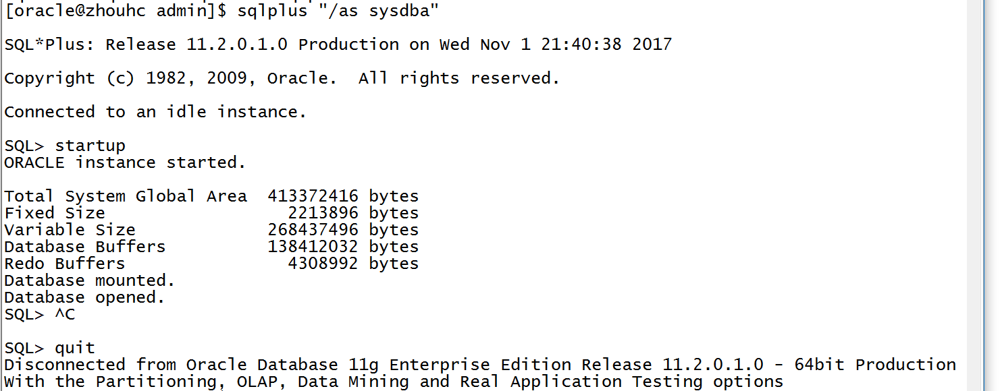

## linux_oracle 问题整理

### oracle 不能启动

今天在启动[服务器](http://www.c114.net/keyword/%B7%FE%CE%F1%C6%F7)上的[Oracle](http://lib.csdn.net/base/oracle)时遇到如下错误：

~~~
SQL> startup;

ORA-00119: invalid specification for system parameter LOCAL_LISTENER

ORA-00132: syntax error or unresolved network name 'LISTENER_ORCL11G'

~~~

在参考网上的资料后，主要意思是先用spfile产生pfile，再修改local_listener的参数，再重新产生spfile，

#### 第一种解决方法

操作前建议先查看/opt/oracle/product/11.2.0/db_1/dbs/ 中有没有spfileorcl11g.ora和initorcl11g.ora 文件如果有，建议执行第二中方法或备份

##### 第一步

复制一份pfile参数文件（注意：oracle中的pfile指的就是init<sid>.ora文件）

~~~
[oracle@zhouhc ~]$ sqlplus "/as sysdba"
SQL> create pfile from spfile='/opt/oracle/product/11.2.0/db_1/dbs/spfileorcl11g.ora';
~~~

结合自己的实例：

##### 第二步：

修改pfile参数文件（也即修改init<sid>.ora文件）

经过第一步以后，在$ORACLE_HOME/dbs目录下发现有这么一个文件init<sid>.ora，这就是我第一步创建的文件。由于我的oracle实例名为orcl11g，所以我的pfile文件为initorcl11g.ora。

其中的localhost为主机名或者主机IP，其实导致ORA-00119和ORA-00132错误的原因就很可能是修改了我的的hostname，但是我看了一下我的tnsname.ora文件里面的那个LISTENER_ORCL11G(可能你不是这个名字)和后面修改的localhost一致，我做的只是将tnsname.ora文件中的(ADDRESS_LIST=(Address= (Protocol=tcp) (Host=localhost)(Port=1521)))复制到pfile文件的“local_listener=”后面，然后就顺利启动了 [数据库](http://lib.csdn.net/base/mysql)，我也不知道为什么直接用*.local_listener='LISTENER_ORCL11G'就找不到，而一定 要*.local_listener='(ADDRESS_LIST=(Address=(Protocol=tcp) (Host=localhost)(Port=1521)))'才可以，这个问题以后研究一下。

以下是我的一个修改样例：

用vi编辑器打开，找到local_listener这一行，然后将其值修改为：

~~~shell
[root@zhouhc dbs]# vi initorcl11g.ora 
orcl11g.__db_cache_size=138412032
orcl11g.__java_pool_size=4194304
orcl11g.__large_pool_size=4194304
orcl11g.__oracle_base='/opt/oracle'#ORACLE_BASE set from environment
orcl11g.__pga_aggregate_target=167772160
orcl11g.__sga_target=247463936
orcl11g.__shared_io_pool_size=0
orcl11g.__shared_pool_size=92274688
orcl11g.__streams_pool_size=0
*.audit_file_dest='/opt/oracle/admin/orcl11g/adump'
*.audit_trail='db'
*.compatible='11.2.0.0.0'
*.control_files='/opt/oracle/oradata/orcl11g/control01.ctl','/opt/oracle/flash_recovery_area/orcl11g/control02.ctl'
*.db_block_size=8192
*.db_domain='us.oracle.com'
*.db_name='orcl11g'
*.db_recovery_file_dest='/opt/oracle/flash_recovery_area'
*.db_recovery_file_dest_size=4070572032
*.diagnostic_dest='/opt/oracle'
*.dispatchers='(PROTOCOL=TCP) (SERVICE=orcl11gXDB)'
# 修改此处的内容
# 修改前
#*.local_listener='LISTENER_ORCL11G'
# 修改后
*.local_listener='(ADDRESS = (PROTOCOL = TCP)(HOST = localhost)(PORT = 1521)))'
*.memory_target=415236096
*.open_cursors=300
*.processes=150
*.remote_login_passwordfile='EXCLUSIVE'
*.undo_tablespace='UNDOTBS1'
~~~

按Esc 后输入 

~~~
:wq
~~~

保存退出

第三步：以pfile创建spfile

使用以下命令创建spfile

~~~sql
SQL> create spfile from pfile='/opt/oracle/product/11.2.0/db_1/dbs/initorcl11g.ora';
~~~

第四步：启动数据库

~~~shell
[oracle@zhouhc ~]$ lsnrctl start

[oracle@zhouhc ~]$ sqlplus "/as sysdba"
SQL> startup;
~~~

#### 第二种解决方法

##### 第一步查看文件

~~~shell
[oracle@zhouhc admin]$ cd /opt/oracle/product/11.2.0/db_1/dbs
[root@zhouhc dbs]# cat initorcl11g.ora 
orcl11g.__db_cache_size=138412032
orcl11g.__java_pool_size=4194304
orcl11g.__large_pool_size=4194304
orcl11g.__oracle_base='/opt/oracle'#ORACLE_BASE set from environment
orcl11g.__pga_aggregate_target=167772160
orcl11g.__sga_target=247463936
orcl11g.__shared_io_pool_size=0
orcl11g.__shared_pool_size=92274688
orcl11g.__streams_pool_size=0
*.audit_file_dest='/opt/oracle/admin/orcl11g/adump'
*.audit_trail='db'
*.compatible='11.2.0.0.0'
*.control_files='/opt/oracle/oradata/orcl11g/control01.ctl','/opt/oracle/flash_recovery_area/orcl11g/control02.ctl'
*.db_block_size=8192
*.db_domain='us.oracle.com'
*.db_name='orcl11g'
*.db_recovery_file_dest='/opt/oracle/flash_recovery_area'
*.db_recovery_file_dest_size=4070572032
*.diagnostic_dest='/opt/oracle'
*.dispatchers='(PROTOCOL=TCP) (SERVICE=orcl11gXDB)'
*.local_listener='LISTENER_ORCL11G'
*.memory_target=415236096
*.open_cursors=300
*.processes=150
*.remote_login_passwordfile='EXCLUSIVE'
*.undo_tablespace='UNDOTBS1'
~~~

##### 第二步修改tnsnames.ora 文件

~~~shell
[root@zhouhc admin]# vi tnsnames.ora 
# 修改前
# zhouhc =
# 修改后
LISTENER_ORCL11G =
  (DESCRIPTION =
    (ADDRESS_LIST =
      (ADDRESS = (PROTOCOL = TCP)(HOST = localhost)(PORT = 1521))
    )
    (CONNECT_DATA =
      (SID = orcl11g)
    )
  )
~~~

##### 第三步 启动数据库

~~~shell
[oracle@zhouhc ~]$ lsnrctl start
[oracle@zhouhc ~]$ sqlplus "/as sysdba"
SQL> startup;
~~~

